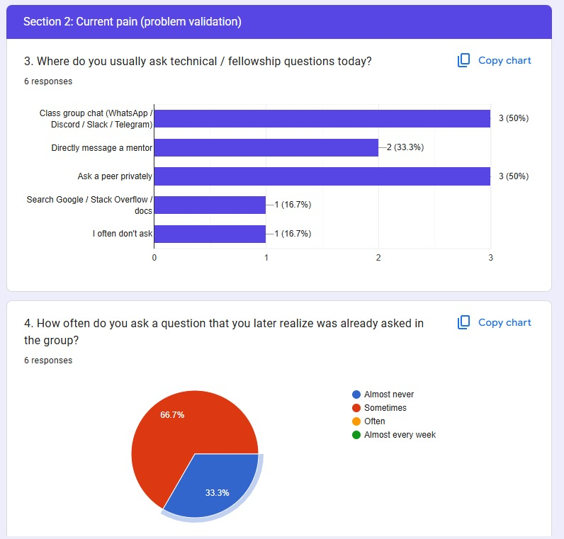
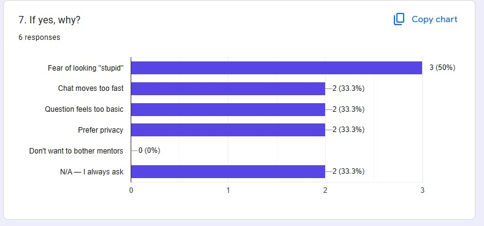
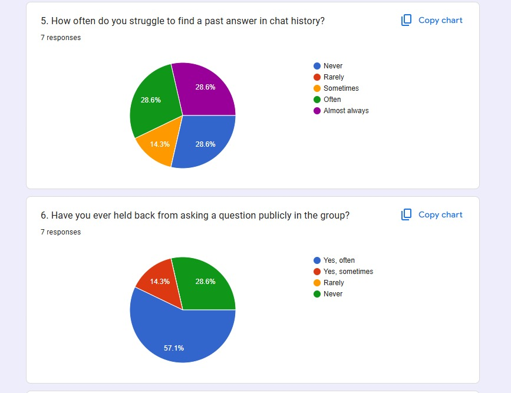

# Study Circle

A searchable knowledge-sharing platform for software development fellowship cohorts.

## Problem

Fellows ask questions in class group chats where answers get buried, the same questions are asked repeatedly across cohorts, and good answers disappear into chat history. Some fellows are uncomfortable asking questions publicly in large groups.

---

## Validation

We surveyed 7 fellows across the Web Development and Data Analytics tracks (mix of 3–6 month and 6+ month/alumni tenure). Key findings:

- **The pain is real, not assumed.** All 7 respondents currently get help through class group chat, DMing a mentor, or asking a peer privately — and 66.7% said they've asked a question they later realized had already been answered in the group.
- **Chat history doesn't work as a knowledge base.** 57% of respondents said they "often" or "almost always" struggle to find a past answer in chat history, and named questions like _"difference between const and let"_ and _"how is software developer think"_ as things asked more than once.
- **Fear, not laziness, keeps people from asking.** 71.4% have held back from asking a question publicly at least once. Of those, the top reasons were fear of looking "stupid" (50%), the chat moving too fast (33.3%), and a preference for privacy (33.3%).
- **Demand for the actual solution is strong.** 85.7% said they'd be "likely" or "very likely" to search a knowledge base before asking in chat, and every single respondent (100%) picked "search by keyword/topic" as a must-have feature, followed by mentor-verified answers (71.4%) and answer notifications (42.9%).
- **There's a starting pool of content.** 2 fellows volunteered to contribute seed questions this week, most estimating they could realistically write 1–3 starter questions each — useful for seeding the knowledge base before demo day.
- Fellows most want existing answers for frontend topics (HTML/CSS/JS/React), soft skills/career/interview prep, and fellowship process questions — each named by 50% of respondents.

### Survey Dashboard & Data Charts

| Survey    | Charts    |
|---------- |---------- |
|Communication Channels & Repetitive Questions | |
| Question Hesitation & Barriers |  |
| Chat History Search Struggles |  |

---

## Solution

Study Circle provides a searchable knowledge base where fellows can:

- Ask questions with titles, detailed bodies, and tags
- Search existing questions and answers
- Comment on posts
- Upvote helpful content
## Project Structure  

text
study-circle/
├── public/
│   └── screenshots/              # Survey dashboard images
├── src/
│   ├── app/
│   │   ├── (auth)/               # Sign in / Sign up pages
│   │   ├── (dash)/               # Protected pages (dashboard, discussions, profile, settings)
│   │   ├── coming-soon/          # Placeholder page
│   │   ├── layout.tsx            # Root layout
│   │   └── page.tsx              # Landing page
│   ├── components/
│   │   ├── Dashboard/            # Dashboard KPIs and charts
│   │   ├── Discussions/          # Post creation, cards, search and filtering
│   │   ├── LandingPage/          # Public landing page sections
│   │   ├── auth/                 # Authentication layouts
│   │   ├── layout/               # Navbar and Sidebar components
│   │   ├── providers/            # TanStack Query provider
│   │   └── ui/                   # Reusable UI components
│   ├── hooks/
│   │   ├── useDebounce.ts
│   │   ├── useLocalStorage.ts
│   │   └── usePagination.ts
│   ├── lib/
│   │   ├── dashboard-data.ts
│   │   ├── env.ts
│   │   ├── utils.ts
│   │   └── supabase/
│   │       ├── client.ts         # Browser client
│   │       ├── middleware.ts     # Auth middleware helpers
│   │       └── server.ts         # Server client
│   ├── services/                 # Data fetching and mutations
│   │   ├── comments.ts
│   │   ├── dashboard.ts
│   │   ├── postDetail.ts
│   │   ├── posts.ts
│   │   └── profile.ts
│   └── types/
│       ├── auth.ts
│       ├── database.types.ts     # Generated Supabase types
│       ├── post.ts
│       └── profile.ts
├── supabase/
│   ├── README.md                 # Migration file guide
│   └── migrations/
├── .env.example                  # Environment variable template
├── eslint.config.mjs
├── next.config.ts
├── package.json
├── postcss.config.mjs
├── README.md
├── tailwind.config.ts
└── tsconfig.json

---

## Tech Stack

- **Framework:** Next.js 15 with App Router
- **Language:** TypeScript
- **Styling:** Tailwind CSS with custom design tokens
- **Backend:** Supabase (PostgreSQL, Auth, Realtime)
- **Validation:** React Hook Form + Zod

---

## Database Design

### Tables

- **profiles** — Public user data linked to auth.users (with role and bio)
- **posts** — Knowledge base entries with full-text search
- **comments** — Threaded discussions on posts
- **votes** — Upvotes on posts and comments (XOR constraint)
- **notifications** — User notifications for role requests and approvals

### Key Decisions

- UUIDs for all primary keys (security, distribution)
- Full-text search with tsvector/GIN index (not ILIKE)
- Partial unique indexes for one-vote-per-user-per-target
- RLS on all tables (never disabled)

---

## User Roles

Study Circle supports three user roles:

| Role | Description |
|------|-------------|
| **Fellow** | Default role. Can create posts, comment, and vote. |
| **Mentor** | Approved contributors with mentor badge on posts/comments. |
| **Admin** | Manages user roles from Admin Panel. |

Fellows can request mentor status from Settings. Admins approve from Admin Panel.

---

## Authentication

Supabase Auth with email/password. Profiles auto-created via trigger on `auth.users` insert.
Authentication credentials (email, hashed password) are stored exclusively in Supabase's managed `auth.users` table, not in our application schema. Our `profiles` table only stores non-sensitive public information. This separation ensures we never handle or store passwords in our application code.

### Authentication Flow

1. User signs up via `supabase.auth.signUp()` → row created in `auth.users`
2. Database trigger automatically creates matching row in `public.profiles`
3. User logs in → Supabase returns JWT containing user UUID
4. JWT stored in secure HTTP-only cookie
5. Every API request includes JWT → `auth.uid()` extracts user UUID
6. RLS policies use `auth.uid()` to enforce ownership rules

---

## Search Strategy

PostgreSQL full-text search using:

- `tsvector` generated from title (weight A), body (weight B), tags (weight C)
- GIN index for performance
- `ts_rank()` for relevance ordering
- Combined with tag filtering via `ANY(tags)`

---

## Security (RLS)

Row Level Security enabled on all tables:

- Public read access for posts and comments
- Authenticated users can only modify their own content
- Vote uniqueness enforced at database level
- Post authors can moderate comments on their posts

---
## Environment Variables

Create a `.env.local` file in the project root and add:

```bash
NEXT_PUBLIC_SUPABASE_URL=your-supabase-project-url
NEXT_PUBLIC_SUPABASE_ANON_KEY=your-supabase-anon-key
## Development Setup

```bash
# 1. Clone the repository

git clone https://github.com/iotb-tech/study-circle.git
cd study-circle

# 2. install dependencies

npm install

# 3. Copy `.env.example` to `.env.local` and add Supabase keys
NEXT_PUBLIC_SUPABASE_URL=your-supabase-project-url
NEXT_PUBLIC_SUPABASE_ANON_KEY=your-supabase-anon-key

# 4. Start dev server

npm run dev

# 5. Apply migrations in `supabase/migrations/` via Supabase SQL Editor
```

---
## Data Fetching

Study Circle uses TanStack Query for server-state management and data fetching.

### Benefits

- Automatic caching for improved performance
- Background refetching when data changes
- Built-in loading and error handling states
- Query invalidation after mutations (posts, comments, votes, profile updates)
- Reduced duplicate API requests across pages

The `QueryProvider` is configured at the application level so all pages and components can access query state consistently.


---
## Team Workflow

- `main` branch is protected and all development go through `dev` branch
- Feature branches for all work
- PRs require review before merge
- Conventional commits (`feat:`, `chore:`, `fix:`, `docs:`)

---

## Migration Workflow

Database migrations live in `supabase/migrations/`. Apply them via Supabase SQL Editor in order.

## Deployment

The application is designed for deployment on Vercel.

### Deployment Steps

1. Push the latest code to the `main` branch
2. Connect the repository to Vercel
3. Configure the required environment variables
4. Trigger a deployment

Production URL:


### Files

- `first-schema.sql` — Core tables, indexes, RLS, full-text search
- `seed-data.sql` — Development seed data with realistic posts, comments, and votes
- `03_avatars_bucket` Creating a storage bucket in Supabase to store the user's profile image

Before running `seed-data.sql`:

1. Create 3 test users via the signup page
2. Get their UUIDs from Supabase → Authentication → Users
3. Replace `USER_1_ID`, `USER_2_ID`, `USER_3_ID` in the seed file with your actual UUIDs
4. Replace `'Person A'`, `'Person B'`, `'Person C'` with your actual display names
5. Run in Supabase SQL Editor

See `supabase/migrations/README.md` for detailed instructions.

---

## Deployment

The application is designed for deployment on Vercel.

### Deployment Steps

1. Push the latest code to the `main` branch
2. Connect the repository to Vercel
3. Configure the required environment variables
4. Trigger a deployment

Production URL:

---

## License

This project was built as part of the IoTB Tech Fellowship Program.